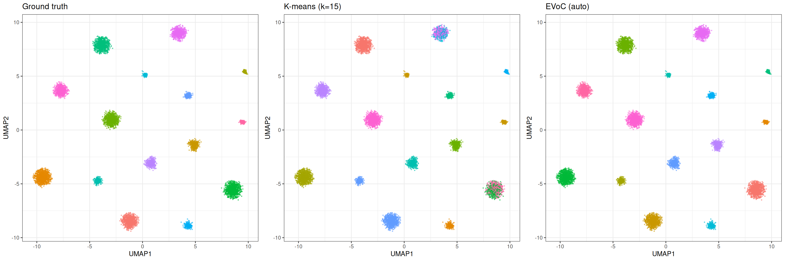

# Clustering methods in manifoldsR (with emphasis on EVoC)

## Clustering in manifoldsR

`manifoldsR` provides two clustering approaches (for now): **k-means**
(full Lloyd’s and mini-batch) and more importantly **EVoC** (Embedding
Vector Oriented Clustering). Both are implemented in Rust with SIMD
acceleration, heavy parallelism and the cache-friendly memory layouts
for speed. The package also ships some cluster evaluation metrics (ARI,
silhouette score and inertia) so you can assess the results without
having to load in another package (of course also made fast in Rust… You
know the drill by now).

``` r

library(manifoldsR)
library(magrittr)
library(ggplot2)
library(data.table)
#> 
#> Attaching package: 'data.table'
#> The following object is masked from 'package:base':
#> 
#>     %notin%
```

### Algorithms at a glance

**K-means** partitions data into exactly `k` clusters by iteratively
assigning points to the nearest centroid and recomputing centroids as
cluster means.

The **full** (Lloyd’s) implementation in `manifoldsR` is heavily
optimised (original from
[ann-search-rs](https://crates.io/crates/ann-search-rs)). For
high-dimensional data (dim \>= 96), it defaults to the Hamerly’s
algorithm: per-point upper and lower distance bounds prune the vast
majority of distance computations after the first few iterations, while
GEMM-based assignment (defaulted to when the dimensionality is high
enough) keeps the remaining work cache-friendly. For Euclidean distance,
this typically prunes 90%+ of point-centroid comparisons after 3-4
iterations, meaning convergence cost is closer to a handful of full
passes than the theoretical worst case. For cosine distance (where
Hamerly’s bounds do not apply, since cosine lacks the triangle
inequality), a full GEMM reassignment is performed each iteration.
Lower-dimensional data (dim \< 96) falls back to direct SIMD-accelerated
loops, which avoid the GEMM kernel overhead at small dimensions. (If you
wish you can actually control the exact dispatch. The
[`params_kmeans()`](https://gregorlueg.github.io/manifoldsR/reference/params_kmeans.md)
give you tight control if needed.)

The **mini-batch** variant (Sculley 2010) samples a random subset of
points per iteration and applies an incremental centroid update with a
decaying learning rate (`eta = 1/count`). The appeal is that each
iteration is cheap: only `batch_size` distance computations instead of
`n`. In practice, however, the full version’s bound-based pruning is so
aggressive that mini-batch does not offer a speed advantage until data
sets become very large (roughly 10M+ points) or cluster structure is
messy enough that Hamerly’s pruning cannot eliminate most candidates. At
moderate scales (up to ~1M), the full version often converges faster in
wall-clock time.

Where mini-batch does differ meaningfully is in its **behaviour under
over-specification of `k`**. Because the incremental learning rate
causes centroids near dense clusters to stabilise quickly (their counts
grow large, shrinking eta), extra centroids in low-density regions
receive few updates and effectively starve. The result is that
mini-batch k-means is more robust to setting `k` higher than the true
number of clusters, i.e., it naturally concentrates mass on the real
structure rather than forcing every centroid to carve out territory.

**EVoC** (Embedding Vector Oriented Clustering) takes a fundamentally
different approach. It constructs a k-nearest neighbour graph, learns a
lower-dimensional embedding optimised for clustering (similar to UMAP,
but with more target dimensions and a different loss focus), then
applies hierarchical density-based clustering (in the spirit of HDBSCAN)
with multi-layer persistence analysis. The key advantage is that EVoC
**does not require you to specify the number of clusters** – it
discovers them automatically and returns multiple layers of granularity
ranked by persistence. It also handles noise and outliers naturally,
assigning them a label of `-1`.

### Synthetic data

We generate a synthetic data set with well-separated clusters in 128
dimensions. This lets us evaluate clustering quality against known
ground truth.

``` r

cluster_data <- manifold_synthetic_data(
  type = "clusters",
  n_samples = 10000L,
  dim = 128L,
  parameters = params_clusters(n_clusters = 15L)
)

n_true <- length(unique(cluster_data$membership))
cat("True number of clusters:", n_true, "\n")
#> True number of clusters: 15
cat("Data dimensions:", dim(cluster_data$data), "\n")
#> Data dimensions: 10000 128
```

For visualisation throughout this vignette, we compute a 2D UMAP
embedding once and reuse it to colour by different cluster assignments.

``` r

umap_embd <- umap(
  data = cluster_data$data,
  k = 15L,
  .verbose = TRUE
)
#> Using n_epochs = 500 (dataset <10k samples or adam_parallel optimiser)

base_df <- as.data.table(umap_embd) %>%
  `colnames<-`(c("UMAP1", "UMAP2")) %>%
  .[, true_cluster := as.factor(cluster_data$membership)]
```

Let’s plot the UMAP with the original cluster assignment

``` r

ggplot(base_df, aes(x = UMAP1, y = UMAP2)) +
  geom_point(aes(colour = true_cluster), size = 0.5, alpha = 0.5) +
  theme_bw() +
  ggtitle("Ground truth clusters (UMAP embedding)")
```


### K-means clustering

#### Full k-means at the correct k

Let’s start with the easy case – we know the true number of clusters and
ask k-means to find exactly that.

``` r

km_correct <- kmeans_cluster(
  data = cluster_data$data,
  k = n_true,
  method = "full",
  seed = 42L,
  .verbose = TRUE
)
#> Running full k-means (k=15, metric=euclidean)
```

``` r

base_df[, km_assignment := as.factor(membership(km_correct))]

ggplot(base_df, aes(x = UMAP1, y = UMAP2)) +
  geom_point(aes(colour = km_assignment), size = 0.5, alpha = 0.5) +
  theme_bw() +
  ggtitle(sprintf("Full k-means (k=%d)", n_true))
```


``` r

cat("ARI:", calc_ari(cluster_data$membership, membership(km_correct)), "\n")
#> ARI: 0.8671586
cat("Inertia:", calc_inertia(km_correct, data = cluster_data$data), "\n")
#> Inertia: 4973336
cat(
  "Silhouette:",
  calc_silhouette_score(
    cluster_data$data,
    membership(km_correct)
  )$mean_silhouette,
  "\n"
)
#> Silhouette: 0.6270099
```

#### Over-specifying k: full vs mini-batch

In practice, you rarely know the true number of clusters. A common
approach is to set `k` higher than expected and see what happens. This
is where the two k-means variants behave quite differently.

``` r

k_over <- 25L

km_full <- kmeans_cluster(
  data = cluster_data$data,
  k = k_over,
  method = "full",
  seed = 42L,
  .verbose = TRUE
)
#> Running full k-means (k=25, metric=euclidean)

km_mini <- kmeans_cluster(
  data = cluster_data$data,
  k = k_over,
  method = "minibatch",
  # reduced batch size here, because it's a small data set
  kmeans_params = params_kmeans(batch_size = 1024L),
  seed = 42L,
  .verbose = TRUE
)
#> Running mini-batch k-means (k=25, batch_size=1024, metric=euclidean)
```

``` r

base_df[, `:=`(
  km_full_over = as.factor(membership(km_full)),
  km_mini_over = as.factor(membership(km_mini))
)]

p_full <- ggplot(base_df, aes(x = UMAP1, y = UMAP2)) +
  geom_point(aes(colour = km_full_over), size = 0.5, alpha = 0.5) +
  theme_bw() +
  theme(legend.position = "none") +
  ggtitle(sprintf("Full k-means (k=%d)", k_over))

p_mini <- ggplot(base_df, aes(x = UMAP1, y = UMAP2)) +
  geom_point(aes(colour = km_mini_over), size = 0.5, alpha = 0.5) +
  theme_bw() +
  theme(legend.position = "none") +
  ggtitle(sprintf("Mini-batch k-means (k=%d)", k_over))

gridExtra::grid.arrange(p_full, p_mini, ncol = 2)
```


Full k-means distributes points across all 25 centroids, splitting true
clusters in two. Mini-batch k-means, due to its incremental learning
rate, effectively lets some centroids starve; they settle in low-density
regions and attract very few points. The result more closely mirrors the
true structure.

``` r

cat("Full k-means:\n")
#> Full k-means:
cat("  ARI:", calc_ari(cluster_data$membership, membership(km_full)), "\n")
#>   ARI: 0.7086227
cat("  Effective clusters:", length(unique(membership(km_full))), "\n")
#>   Effective clusters: 25
cat(
  "  Silhouette:",
  calc_silhouette_score(
    cluster_data$data,
    membership(km_full)
  )$mean_silhouette,
  "\n"
)
#>   Silhouette: 0.4140061

cat("\nMini-batch k-means:\n")
#> 
#> Mini-batch k-means:
cat("  ARI:", calc_ari(cluster_data$membership, membership(km_mini)), "\n")
#>   ARI: 0.9051442
cat("  Effective clusters:", length(unique(membership(km_mini))), "\n")
#>   Effective clusters: 25
cat(
  "  Silhouette:",
  calc_silhouette_score(
    cluster_data$data,
    membership(km_mini)
  )$mean_silhouette,
  "\n"
)
#>   Silhouette: 0.4005103
```

#### Elbow plot with inertia

Inertia (within-cluster sum of squares) decreases monotonically as `k`
increases. The “elbow”, the point where adding more clusters stops
yielding meaningful improvement, suggests a reasonable `k`.

``` r

k_values <- seq(2L, 30L, by = 2L)

elbow_results <- lapply(k_values, function(k) {
  res <- kmeans_cluster(
    data = cluster_data$data,
    k = k,
    method = "full",
    seed = 42L,
    .verbose = FALSE
  )
  data.table(
    k = k,
    inertia = calc_inertia(res, data = cluster_data$data),
    ari = calc_ari(cluster_data$membership, membership(res))
  )
}) %>%
  rbindlist()

ggplot(elbow_results, aes(x = k)) +
  geom_line(aes(y = inertia)) +
  geom_point(aes(y = inertia)) +
  geom_vline(xintercept = n_true, linetype = "dashed", colour = "red") +
  annotate(
    "text",
    x = n_true + 1,
    y = max(elbow_results$inertia) * 0.9,
    label = sprintf("true k = %d", n_true),
    hjust = 0,
    colour = "red"
  ) +
  theme_bw() +
  labs(x = "k", y = "Inertia (WCSS)") +
  ggtitle("Elbow plot")
```


``` r

ggplot(elbow_results, aes(x = k, y = ari)) +
  geom_line() +
  geom_point() +
  geom_vline(xintercept = n_true, linetype = "dashed", colour = "red") +
  theme_bw() +
  labs(x = "k", y = "Adjusted Rand Index") +
  ggtitle("ARI vs k")
```


ARI peaks at the true number of clusters and degrades as k-means is
forced to split well-separated groups.

### EVoC clustering

EVoC does not require specifying `k`. It discovers cluster structure
automatically and returns multiple layers of granularity.

``` r

evoc_res <- evoc(
  data = cluster_data$data,
  n_neighbours = 15L,
  seed = 42L,
  .verbose = TRUE
)

evoc_res
#> Evoc
#>   layers:               3 
#>   best layer:           3 
#>   best persistence:     2655.326 
#>   knn:                  not stored
```

``` r

evoc_best <- best_membership(evoc_res)

cat("Selected layer:", evoc_best$layer, "\n")
#> Selected layer: 3
cat("Persistence score:", round(evoc_best$persistence, 4), "\n")
#> Persistence score: 2655.326
cat(
  "Clusters found:",
  length(unique(evoc_best$labels[evoc_best$labels != -1L])),
  "\n"
)
#> Clusters found: 15
cat("Noise points:", sum(evoc_best$labels == -1L), "\n")
#> Noise points: 0
```

``` r

base_df[, evoc_label := as.factor(evoc_best$labels)]

ggplot(base_df, aes(x = UMAP1, y = UMAP2)) +
  geom_point(aes(colour = evoc_label), size = 0.5, alpha = 0.5) +
  theme_bw() +
  ggtitle("EVoC (best persistence layer)")
```


We can appreciate that EVoC identified (nearly) perfectly the ground
truth…

``` r

# exclude noise points for ARI
non_noise <- evoc_best$labels != -1L
cat(
  "ARI (excl. noise):",
  calc_ari(
    cluster_data$membership[non_noise],
    evoc_best$labels[non_noise]
  ),
  "\n"
)
#> ARI (excl. noise): 1
```

This is also apparent in the ARI score of ≥0.99.

#### Multiple layers

EVoC returns a hierarchy of clusterings at different granularities,
ranked by persistence. Layers with higher persistence scores represent
more stable cluster structures.

``` r

n_layers <- length(evoc_res$persistence_scores)

persistence_df <- data.table(
  layer = seq_len(n_layers),
  persistence = evoc_res$persistence_scores,
  n_clusters = vapply(
    evoc_res$cluster_layers,
    function(l) {
      length(unique(l[l != -1L]))
    },
    integer(1)
  )
)

ggplot(persistence_df, aes(x = layer, y = persistence)) +
  geom_col() +
  geom_text(aes(label = n_clusters), vjust = -0.5, size = 3) +
  theme_bw() +
  labs(x = "Layer", y = "Persistence score") +
  ggtitle("EVoC layer persistence (numbers = cluster count)")
```


#### Approximate number of clusters

If you do have a rough idea of how many clusters to expect, you can
guide EVoC with `approx_n_clusters`. This performs a binary search over
the minimum cluster size parameter to target approximately that many
clusters, returning a single layer.

``` r

evoc_approx <- evoc(
  data = cluster_data$data,
  n_neighbours = 15L,
  evoc_params = params_evoc(approx_n_clusters = n_true),
  seed = 42L,
  .verbose = FALSE
)

evoc_approx_best <- best_membership(evoc_approx)
cat(
  "Clusters found:",
  length(unique(
    evoc_approx_best$labels[evoc_approx_best$labels != -1L]
  )),
  "\n"
)
#> Clusters found: 15
```

### Comparison

Let’s just compare at the end the methods

``` r

base_df[, evoc_approx_label := as.factor(evoc_approx_best$labels)]

p_true <- ggplot(base_df, aes(x = UMAP1, y = UMAP2)) +
  geom_point(aes(colour = true_cluster), size = 0.4, alpha = 0.5) +
  theme_bw() +
  theme(legend.position = "none") +
  ggtitle("Ground truth")

p_km <- ggplot(base_df, aes(x = UMAP1, y = UMAP2)) +
  geom_point(aes(colour = km_assignment), size = 0.4, alpha = 0.5) +
  theme_bw() +
  theme(legend.position = "none") +
  ggtitle(sprintf("K-means (k=%d)", n_true))

p_evoc <- ggplot(base_df, aes(x = UMAP1, y = UMAP2)) +
  geom_point(aes(colour = evoc_label), size = 0.4, alpha = 0.5) +
  theme_bw() +
  theme(legend.position = "none") +
  ggtitle("EVoC (auto)")

gridExtra::grid.arrange(p_true, p_km, p_evoc, ncol = 3)
```



K-means requires specifying `k` and produces exactly that many clusters
with no notion of noise. EVoC discovers the number of clusters
automatically, handles noise and outliers, and provides multiple
granularity layers. For well-separated clusters where you know `k`, both
methods perform well (mini batch k-means can be superior pending the
underlying data structure). EVoC shines when the number of clusters is
unknown or the data contains noise, i.e., situations where k-means
requires manual tuning and repeated runs with different `k` values.

The mini-batch variant of k-means offers a practical middle ground for
large data sets: it converges faster and degrades more gracefully when
`k` is over-specified, at the cost of slightly less precise centroid
placement.
