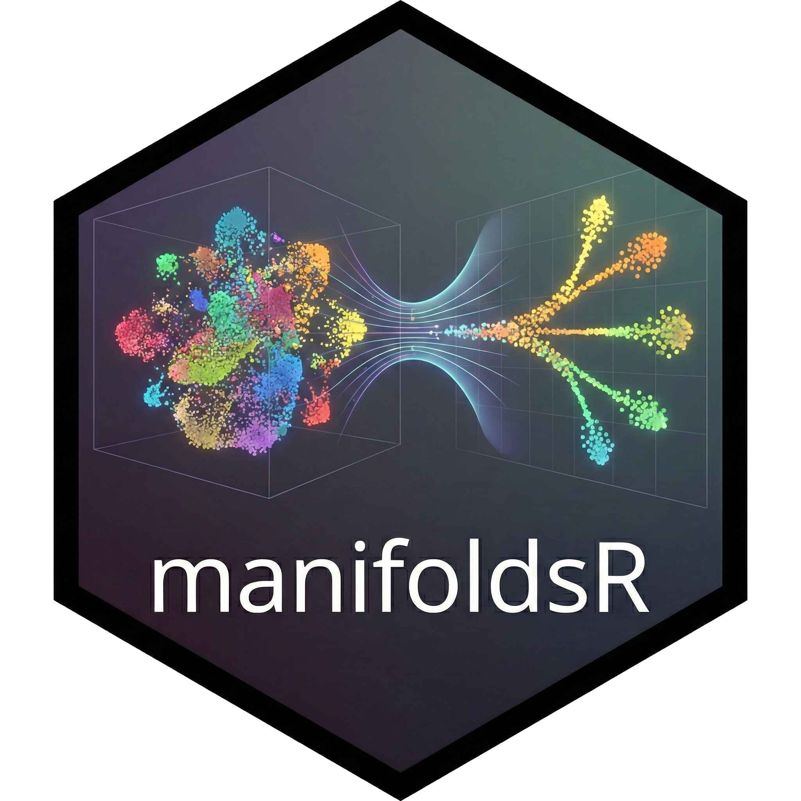

# manifoldsR

[](https://github.com/GregorLueg/genewalkR/actions/workflows/R-cmd-check.yml)
[](https://opensource.org/licenses/MIT)
[](https://gregorlueg.github.io/manifoldsR/)



**Fast(!)** manifold learning methods implemented in Rust with R
bindings… For the modern-day single-cell Wannebe Pollock.

## Overview

`manifoldsR` provides high-performance implementations of popular
dimensionality reduction techniques:

- **UMAP** (Uniform Manifold Approximation and Projection with various
  optimisers which makes this fast.)
- **t-SNE** (t-Distributed Stochastic Neighbor Embedding - Barnes-Hut
  and FFT-accelerated Interpolation-based versions)
- **PHATE** (Potential of Heat-diffusion for Affinity-based Trajectory
  Embedding)
- **PaCMAP** (Pairwise Controlled Manifold Approximatio)

The core algorithms are implemented purely in Rust without any kernel
switching for speed while providing user-friendly R interfaces. The
optimisations here make them in parts substantially faster than other
libraries typically used in the R ecosystem to run these methods. The
backbone here are the Rust crates that enable [approximate nearest
neighbour searches](https://github.com/GregorLueg/ann-search-rs) and the
underlying [manifold learning
methods](https://github.com/GregorLueg/manifolds-rs). The underlying
philosophy is to strip out most additional features and focus on the
core mechanics and make them as fast as possible, avoid abstraction
layers and indirection wherever possible and let llvm do its magic to
generate fast code.

## Installation

### Prerequisites

This package requires Rust to be installed on your system. If you don’t
have Rust installed:

**macOS and Linux:**

``` bash
curl --proto '=https' --tlsv1.2 -sSf https://sh.rustup.rs | sh
```

**Windows:**

Download and run the installer from [rustup.rs](https://rustup.rs/)

After installation, restart your terminal and verify Rust is installed:

``` bash
rustc --version
```

### Install manifoldsR

``` r
# Install from source
remotes::install_github("GregorLueg/manifoldsR")
```

## How to use the package … ?

Please check out the
[website](https://gregorlueg.github.io/manifoldsR/index.html) and
associated vignettes. Changelog can be found
[here](https://github.com/GregorLueg/manifoldsR/blob/main/NEWS.md).

## Roadmap

For now the package covers the most common embedding versions. Future
features are likely to include:

- Density-preserving versions of UMAP and tSNE, see [Narayan, et
  al.](https://www.nature.com/articles/s41587-020-00801-7)
- ~~PacMap from [Wang et. al.](https://arxiv.org/abs/2012.04456), that
  should preserve global structure better.~~ (Done with version 0.1.1)

## License

Copyright (c) 2026 manifoldsR authors

Permission is hereby granted, free of charge, to any person obtaining a
copy of this software and associated documentation files (the
“Software”), to deal in the Software without restriction, including
without limitation the rights to use, copy, modify, merge, publish,
distribute, sublicense, and/or sell copies of the Software, and to
permit persons to whom the Software is furnished to do so, subject to
the following conditions:

The above copyright notice and this permission notice shall be included
in all copies or substantial portions of the Software.

THE SOFTWARE IS PROVIDED “AS IS”, WITHOUT WARRANTY OF ANY KIND, EXPRESS
OR IMPLIED, INCLUDING BUT NOT LIMITED TO THE WARRANTIES OF
MERCHANTABILITY, FITNESS FOR A PARTICULAR PURPOSE AND NONINFRINGEMENT.
IN NO EVENT SHALL THE AUTHORS OR COPYRIGHT HOLDERS BE LIABLE FOR ANY
CLAIM, DAMAGES OR OTHER LIABILITY, WHETHER IN AN ACTION OF CONTRACT,
TORT OR OTHERWISE, ARISING FROM, OUT OF OR IN CONNECTION WITH THE
SOFTWARE OR THE USE OR OTHER DEALINGS IN THE SOFTWARE.
